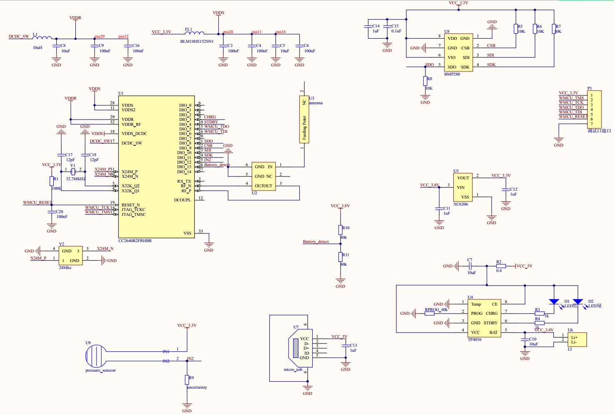

# Medically-assisted-evaluation-devices
The project started at about September 2017. The interns need to practice on the simulation baby about cardiopulmonary resuscitation (CPR) and the operation of the oxygen bottle. Current evaluation method is by experienced doctor, the project aims at using extra devices to evaluate the intern's operation. Unfortunately, the project just completed partly because my tutor failed to cooperate with the hospital, it's hard for me to get the actual data to analyse.

**Schematic Diagram**
The schematic digram of the device is as follows. The device is powered by a very small lithium battery, so I add a extra charging circuit which adopts TP4056 chip.

**CC2640R2F Simple peripheral**
The project is modified based on the "simple peripheral" demo code which is provided by TI company, the project is based on TI RTOS. To ensure the function of bluetooth not be affected, the CC2640R2f just read the raw data from BMP280(a pressure sensor), the data processing will be moved to android app.

**CC2640R2F Android App**
This is a demo app which can scan and search surrounding Bluetooth Low Energy (BLE). The app will then connect our BLE device which is based on cc2640r2f chip, find our defined air pressure service, get the raw pressue data based on characteristic and characteristic handle. Finally, the app will process the data to get the actual air pressure.
[Demo video](https://www.youtube.com/watch?v=rRohZTgR_Ls)

